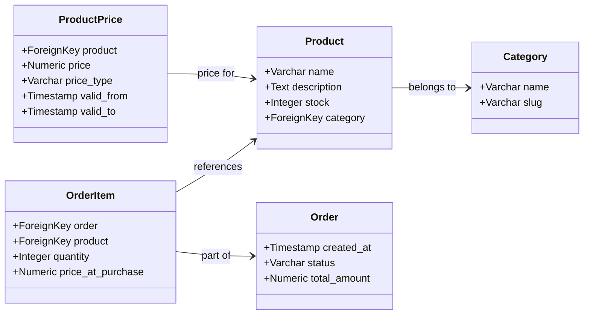

# App Docs

## Models

```mermaid
classDiagram
    direction LR
    class Category {
        +Varchar name
        +Varchar slug
    }
    class Product {
        +Varchar name
        +Text description
        +Integer stock
        +ForeignKey category
    }
    class ProductPrice {
        +ForeignKey product
        +Numeric price
        +Varchar price_type
        +Timestamp valid_from
        +Timestamp valid_to
    }
    class Order {
        +Timestamp created_at
        +Varchar status
        +Numeric total_amount
    }
    class OrderItem {
        +ForeignKey order
        +ForeignKey product
        +Integer quantity
        +Numeric price_at_purchase
    }

    Product --> Category : belongs to
    ProductPrice --> Product : price for
    OrderItem --> Order : part of
    OrderItem --> Product : references

```